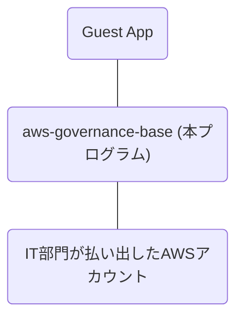

# aws-governance-base

## 🚀 はじめに

自社の IT 部門が「AWS Config, CloudTrail, SecurityHub」をセットアップ済みの AWS アカウントを、利用部門に振り出しています。  
そして、その AWS アカウントに対して統制基盤として足りない構成を追加する役割が aws-governance-base (本プログラム) です。

## 🚀 実現したいこと

- セキュリティ

  - 権限分離を簡単にしたい(IAM Policy を頑張る泥沼に沈みたくない)
  - Security Hub のコンプライアンスチェックの結果を環境ごとに分離したい
  - Security Hub からのセキュリティリスク検知の各種通知を環境ごとに分離したい
  - IAM Access Analyzer の IAM Policy 自動生成機能を簡単に活用したい

- 信頼性

  - サービスクオータを分離したい

- コスト最適化

  - コスト可視化の分離を簡単に把握したい

- 運用上の優秀性
  - DevOps Guru を簡単に利用したい
  - 開発環境、学習環境といった色々な環境を簡単かつ安全に増減したい

## 🚀 設計方針

「実現したいこと」を達成するために以下に示す設計方針にしました。

- マルチアカウント構成
- Guest App を開発・運用する環境には aws-governance-base のためのリソースを極力作成しない。  
   （Security Hub, IAM Access Analyzer, DevOps Guru といったサービスが aws-governance-base のリソースに反応してしまう問題を最小化する目的）

## 🚀 設計

### 🛸 AWS アカウント構成

aws-governance-base は以下に示す 3 種類の AWS アカウントで構成された環境を作成します。

- Jump アカウント  
   IAM User がログインする AWS アカウントです。  
   Jump アカウントは必ず１つだけ作成します。
- Audit アカウント  
   セキュリティ系の機能を担う AWS アカウントです。  
   というつもりでしたが、共通機能をデプロイする AWS アカウントになってしまいました。  
   Audit アカウントは必ず１つだけ作成します。
- Guest アカウント  
   本番、ステージング、開発、学習 といった用途の AWS アカウントです。  
   Gust アカウントは１つ以上作成できます。

### 🛸 機能ごとの説明

以下、セットアップ順で記載。

- common  
  [./cfn/common/README.md](./cfn/common/README.md)

- Account Password Policy  
  本機能は CFn 非対応であるため AWS SDK for JS の API で設定している。  
  全 AWS アカウントの ap-northeast-1 に対してパスワードポリシーの設定をする。  
  [./src/feature/account-password-policy.ts](./src/feature/account-password-policy.ts)

- Jump アカウント  
  [./cfn/jump/README.md](./cfn/jump/README.md)

- guard-duty  
  [./cfn/guard-duty/README.md](./cfn/guard-duty/README.md)

- iam-access-analyzer  
  [./cfn/iam-access-analyzer/README.md](./cfn/iam-access-analyzer/README.md)

- event-aggregation  
  [./cfn/event-aggregation/README.md](./cfn/event-aggregation/README.md)

- event-notification  
  [./cfn/event-notification/README.md](./cfn/event-notification/README.md)

- devops-guru  
  [./cfn/devops-guru/README.md](./cfn/devops-guru/README.md)

- config-rule  
  [./cfn/config-rule/README.md](./cfn/config-rule/README.md)

- auto-remediation  
  [./cfn/auto-remediation/README.md](./cfn/auto-remediation/README.md)

- detective  
  [./cfn/detective/README.md](./cfn/detective/README.md)
  > **Warning**  
  > GuardDuty をデプロイしてから 48 時間以上経過してからデプロイすること。

## 🚀 デプロイ方法

[./how-to-deploy.md](./how-to-deploy.md)

## 🚀 開発

[./how-to-develop.md](./how-to-develop.md)
