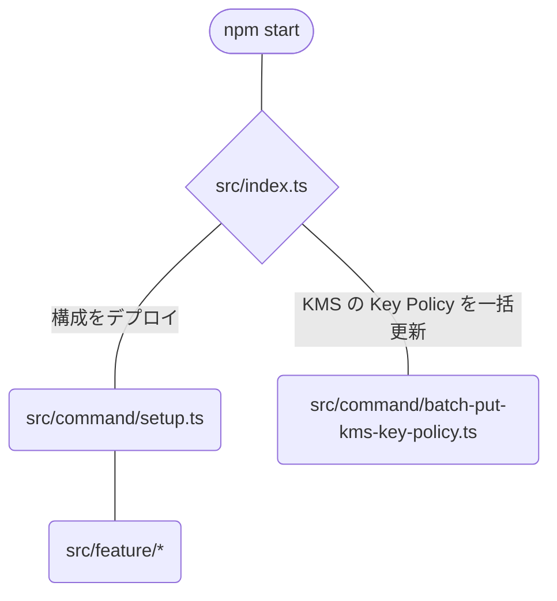

# 開発に関する情報

## 🚀 開発環境

[./system-requirement.md](./system-requirement.md)

## 🚀 cfn-lint

cfn-lint のアップデートは下記を実行する。

```shell
ika-musume:/workspace$ poetry update cfn-lint
```

## 🚀 ディレクトリの説明

- .devcontainer  
  DevContainer のリソースのディレクトリ。
- .vscode  
  vscode 設定のディレクトリ。
- cfn  
  CFn のリソースのディレクトリ。  
  機能ごとにディレクトリが分かれている。
- src
  - index.ts  
    `npm start` で実行されるプログラムの開始点。
  - aws/cfn/deployer.ts  
    `aws cloudformation deploy` コマンド相当の機能。
  - command
    - setup.ts
      「構成をデプロイ」するコマンドの実装。
    - batch-put-kms-key-policy.ts
      「KMS の Key Policy を一括更新」するコマンドの実装。
  - feature  
    `setup.ts` でデプロイできる機能の実装。  
    機能ごとにファイルが分かれている。

## 🚀 ソースコードの関係

ソースコードの関係を主たる部分だけ図示する。



## 🚀 Lambda 関数のデプロイ

開発用のデプロイオプションを下に説明する。

- Lambda 関数をデプロイするが Alias には発行しない  
  `--lambda-disable-publish-to-alias` オプション

  ```shell
  $ # 例
  $ npm start -- setup -c ~/foo/agb-config.yaml --feature event-notification --aws-account-id 012345678901 --region ap-northeast-1 --lambda-disable-publish-to-alias --debug
  ```

- Lambda 関数を高速にデプロイ  
  feature として`fast-deploy--event-notification-func`を指定する。

  ```shell
  $ # 例
  $ npm start -- setup -c ~/foo/agb-config.yaml --feature fast-deploy--event-notification-func --aws-account-id 012345678901 --region ap-northeast-1 --debug
  ```

## 🚀 反省

### 🛸 スタックの削除が辛い

インポート機能が実用的な Terraform or CDK for Terraform に引っ越しするかな。  
でも、そうしたら今度は tfstate ファイルの管理という問題が出てくる。  
CFn VS Terraform どっちが良いのか悩ましい。

### 🛸 Audit アカウントを監査以外の用途でも使っている

下記２つにすればよかった。

- Audit  
   セキュリティー関係の調査用。
- Commons  
   共通機能を何でもここに置いてしまう。  
   セキュリティ関係の通知設定とかもここ。
